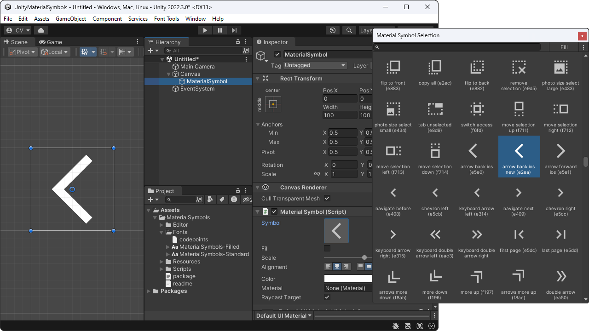
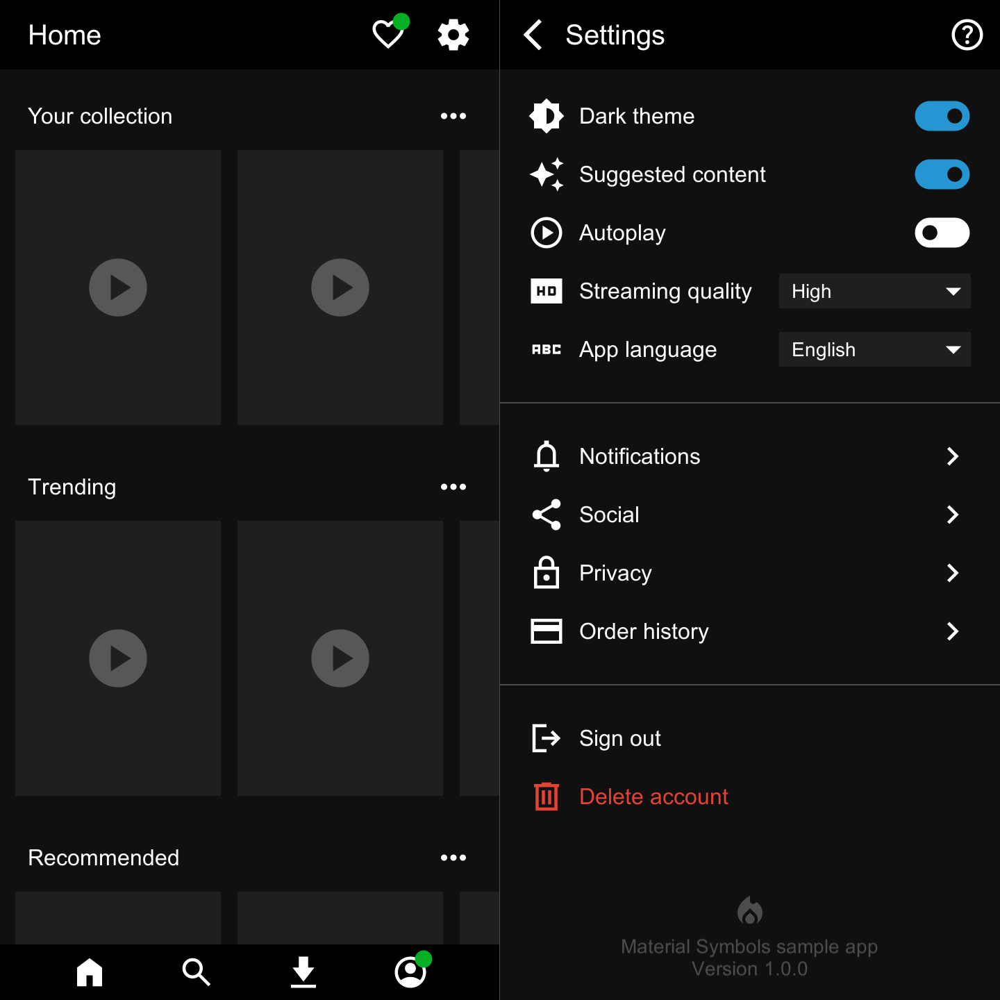
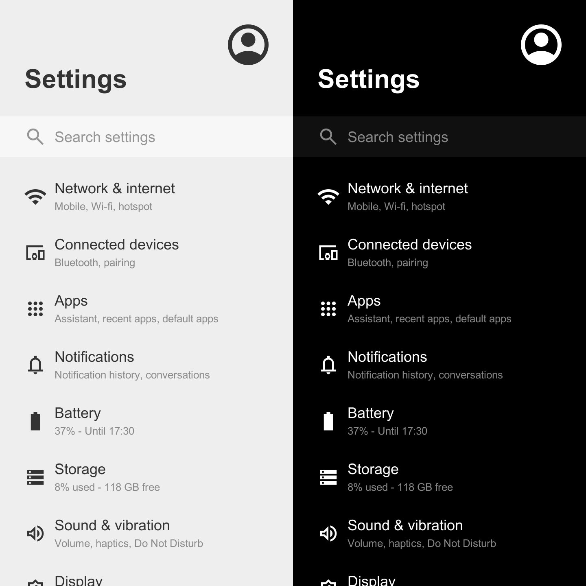
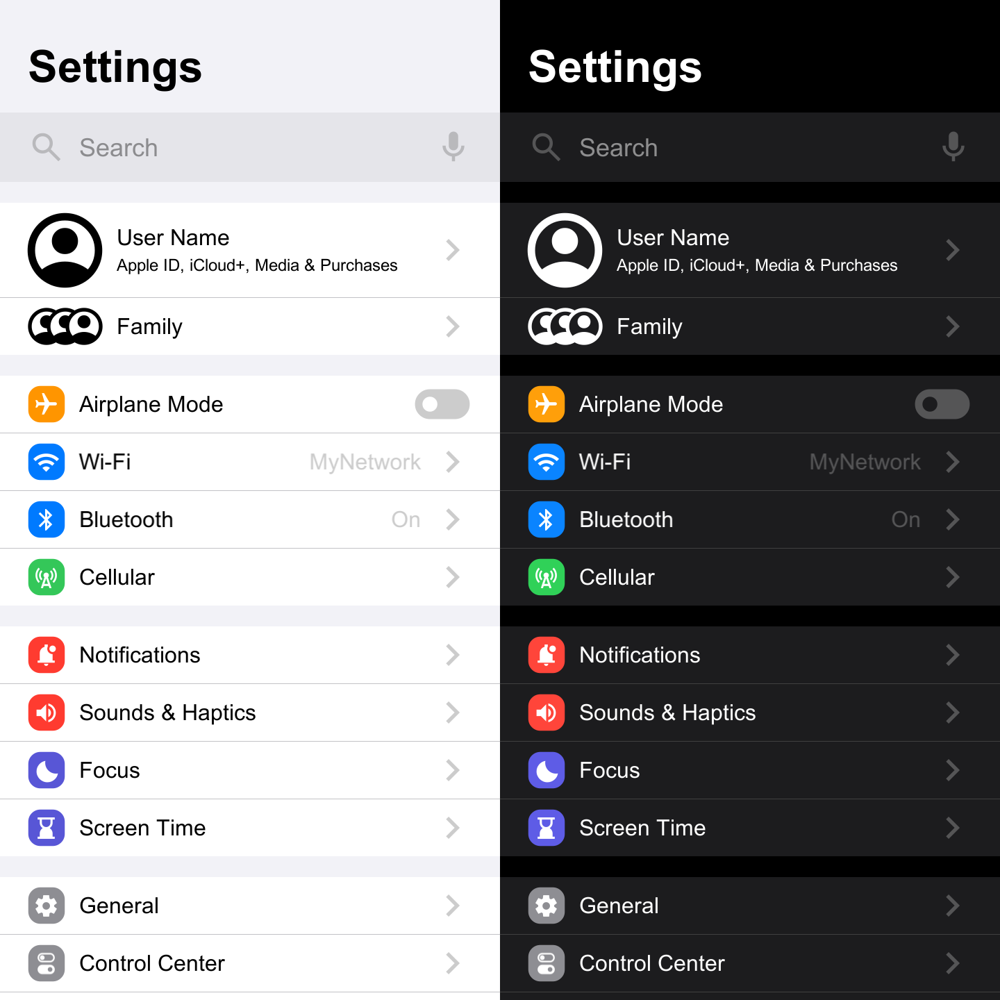

# Material Symbols (Icons) for Unity

[](https://ko-fi.com/convalise/?hidefeed=true&widget=true&embed=true&preview=true)

Add-on that simplifies the usage of Google's **Material Symbols** (previously known as Material Icons) on Unity. The motivation is to have a lightweight set of uniform icons in order to provide the same design throughout the application UI, improving UX.

Recommended Unity versions are 2022 or higher.\
Supported Unity versions are 2017 or higher.

<a href='https://raw.githubusercontent.com/convalise/unity-material-symbols/master/doc/preview.png'></a>

## Samples Gallery

<a href='https://raw.githubusercontent.com/convalise/unity-material-symbols/master/doc/sample-1.png'></a> <a href='https://raw.githubusercontent.com/convalise/unity-material-symbols/master/doc/sample-2.png'></a> <a href='https://raw.githubusercontent.com/convalise/unity-material-symbols/master/doc/sample-3.png'></a>

## Quickstart

### Import automatically through the Package Manager

On the Package Manager, select "Add package from git" and paste the following URL:

```
https://github.com/convalise/unity-material-symbols.git?path=/src/UnityMaterialSymbols/Assets/MaterialSymbols
```

### Import manually through a Unity Package

Download the package from the [latest release](https://github.com/convalise/unity-material-symbols/releases/latest) and import into your project as usual.

On Unity 2018 or lower, you might need to delete the `asmdef` files inside the Scripts and Editor folders.

### Usage

Simply add the `MaterialSymbol` component to your GameObject and you are good to go.

Alternatively, a new object can be added to the scene by right-clicking on the hierarchy window and selecting `UI > Google > Material Symbol`.

The inspector provides a window to easily select between the available icons.

## Documentation

The `MaterialSymbol` class inherits from `UnityEngine.UI.Text`, so it has all properties and methods available [here](https://docs.unity3d.com/Packages/com.unity.ugui@1.0/manual/script-Text.html) such as color and raycast target.

Each icon is composed by a pair of a [unicode-escaped char](https://learn.microsoft.com/en-us/dotnet/csharp/language-reference/builtin-types/char#literals) and a boolean representing the glyph code and the fill status respectively.

The icon can be set programmatically by setting the `symbol` field with a new `MaterialSymbolData` object:
```cs
materialSymbol.symbol = new MaterialSymbolData('\uEF55', false);
```
It can also be set directly by setting the `code` and `fill` properties:
```cs
materialSymbol.code = '\uEF55';
materialSymbol.fill = false;
```

Additionally, a serialized `MaterialSymbolData` field can be used to bring the icon inspector on any class:

```cs
public MaterialSymbolData newIcon;

public void DoSomething()
{
    materialSymbol.symbol = newIcon;
    materialSymbol.color = Color.blue;
}
```

## FAQ

### 1) What's the difference between "Material Symbols" and "Material Icons"?

The Material Symbols font was introduced in 2022 and is the variable version of the original Material Icons font. This means that supported applications (e.g., web browsers) can take advantage of the variable axes in the Material Symbols font for further refinements and animations. Also, the original Material Icons font has not been updated in many years, most likely being deprecated.

### 2) Does Unity support variable fonts?

As of the day this package was created, no, Unity has not yet added support for variable font axes. Due to this limitation, a static version of the Material Symbols font is being used on this project — and it's a lot smaller than the variable version, which is very nice.

### 3) Which font variation the package is based on?

This package uses the Sharp style. In oder to provide both filled and non-filled icons two font files are being used, both regular weight, adding a total of about 1.5 MB to the build size.

### 4) Will the package include other variations in the future?

It would not be wise because providing variations will unnecessarily increase the build size, so at least for now only the Sharp style will be included. Also, it kind of defeats the purpose of this package being a **lightweight** source of icons — 1.5 MB is already a lot for font files honestly speaking.

### 5) Can I replace the included font with a different variation?

Yes, but at your own risk. You're free to download and use any variation you like from any source you want, just make sure to replace both `ttf` files on the package Fonts folder (overwrite with the same name and don't delete the `meta` files). Bear in mind that the codepoints file must match the font version, so depending on your source you'll most likely need to replace it as well.

#### 5.1) Alternative

In order to minimize bad decisions, I've made a list of font variations available for download on [this page](URLs.md). They have a compact file size and the included codepoints file is already compatible with them.

#### 5.2) Disclaimer

While I'm reluctant to include variations in the package as previously explained, replacing the font with another one is a lot better than having 9 or 21 variations simultaneously included in the build. Besides, the only downside of this decision is the lost ability to mix styles, but mixing styles is bad design anyway :)

### 6) Can I use the package with TextMeshPro?

Well, I personally see no advantages in using TMP because it adds a lot of unnecessary overhead to get the same result, but technically speaking, yes you can. You'll need to create the `TMP_FontAsset` using the official methods and manually set the unicode-escaped string to the `TMP_Text` though.

### 7) I liked your work, can I buy you a coffee?

Thank you, I'd love that! You can warm my heart on this [Ko-fi link](https://ko-fi.com/convalise/?hidefeed=true&widget=true&embed=true&preview=true), or this [PayPal link](https://www.paypal.com/cgi-bin/webscr?cmd=_s-xclick&hosted_button_id=YAUUBSC3KYUEC&source=url). I'm also available on [GitHub Sponsors](https://github.com/sponsors/convalise).

## Credits

This project was created by Conrado (https://github.com/convalise).

It makes usage of the [Material Design icons by Google (Material Symbols)](https://github.com/google/material-design-icons).\
More information on the Google's project can be found at the [Material Icons Guide](https://developers.google.com/fonts/docs/material_icons).
