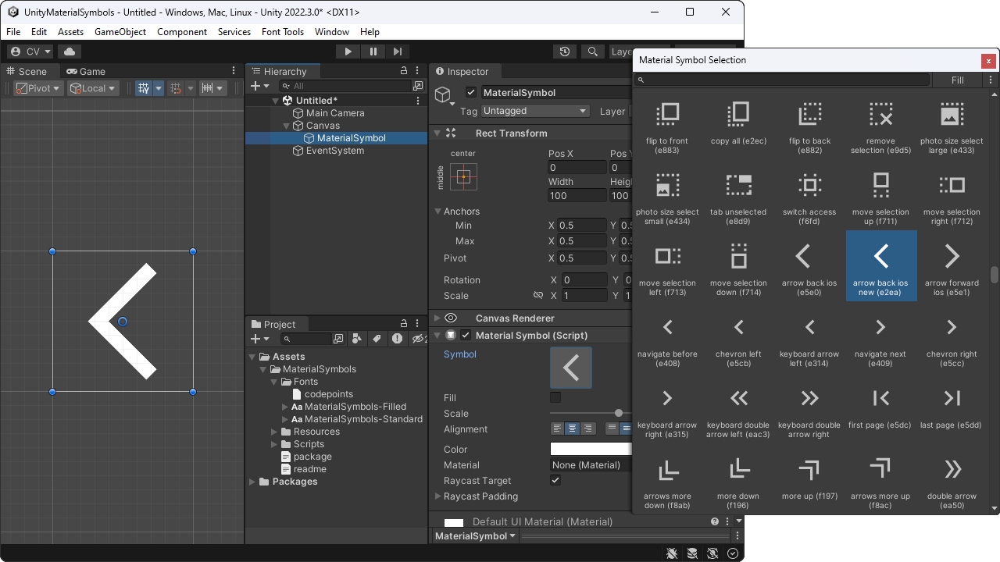

# Material Symbols (Icons) for Unity

[](https://ko-fi.com/convalise/?hidefeed=true&widget=true&embed=true&preview=true)

Add-on that simplifies the usage of Google's **Material Symbols** (formerly known as Material Icons) in Unity. The goal is to provide a lightweight set of uniform icons to ensure consistent design throughout the application UI and improve UX.

Recommended Unity version: 2022 or later\
Supported Unity versions: 2017 or later

<a href='https://raw.githubusercontent.com/convalise/unity-material-symbols/master/doc/preview.png'></a>

## Samples Gallery

<a href='https://raw.githubusercontent.com/convalise/unity-material-symbols/master/doc/sample-1.png'></a> <a href='https://raw.githubusercontent.com/convalise/unity-material-symbols/master/doc/sample-2.png'></a> <a href='https://raw.githubusercontent.com/convalise/unity-material-symbols/master/doc/sample-3.png'></a>

## Quickstart

### Import automatically through the Package Manager

In the Package Manager, select to install package from git and paste the following URL:

```
https://github.com/convalise/unity-material-symbols.git?path=/src/UnityMaterialSymbols/Assets/MaterialSymbols
```

### Import manually through a Unity Package

Download the package from the [latest release](https://github.com/convalise/unity-material-symbols/releases/latest) and import it into your project as usual.

Note: On Unity 2018 or earlier, you might need to delete the `asmdef` files inside the Scripts folder.

### Usage

Simply add the `MaterialSymbol` component to your GameObject and you're good to go.

Alternatively, a new object can be added to the scene by right-clicking in the Hierarchy window and selecting `UI > Google > Material Symbol`.

The inspector provides a window to easily select between the available icons.

## Documentation

The `MaterialSymbol` class inherits from `UnityEngine.UI.Text`, so it has all the properties and methods available [here](https://docs.unity3d.com/Packages/com.unity.ugui@1.0/manual/script-Text.html) such as color and raycast target.

Each icon is made up of two values: a [unicode-escaped char](https://learn.microsoft.com/en-us/dotnet/csharp/language-reference/builtin-types/char#literals) for the symbol itself, and a boolean to indicate whether it's filled or outlined.

The icon can be set programmatically by assigning a new `MaterialSymbolData` object to the `symbol` field:
```cs
materialSymbol.symbol = new MaterialSymbolData('\uEF55', false);
```
It can also be set directly by assigning the `code` and `fill` properties:
```cs
materialSymbol.code = '\uEF55';
materialSymbol.fill = false;
```

Additionally, a serialized `MaterialSymbolData` field can be used to expose the icon inspector in any class:

```cs
public MaterialSymbolData newIcon;

public void DoSomething()
{
    materialSymbol.symbol = newIcon;
    materialSymbol.color = Color.blue;
}
```

## FAQ

### 1) What's the difference between "Material Symbols" and "Material Icons"?

The Material Symbols font was introduced in 2022 and is the variable version of the original Material Icons font. This means that supported applications (e.g., web browsers) can take advantage of the variable axes in the Material Symbols font for further refinements and animations. Also, the original Material Icons font has not been updated in many years and appears to be no longer maintained.

### 2) Does Unity support variable fonts?

As of the date this package was created, no — Unity has not yet added support for variable font axes. Due to this limitation, a static version of the Material Symbols font is used in this project — and it's much smaller than the variable version, which also helps keep the project lightweight.

### 3) Which font variation is the package based on?

This package uses the Sharp style. In order to provide both filled and non-filled icons, two font files are used, both regular weight, adding a total of about 1.5 MB to the build size.

### 4) Will the package include other variations in the future?

Including more variations would likely add unnecessary bloat, since each additional style increases the build size. So at least for now, only the Sharp style will be included. Also, that kind of defeats the purpose of this package being a **lightweight** source of icons — 1.5 MB is already quite a lot for font files, practically speaking.

### 5) Can I replace the included font with a different variation?

To make replacement easier and minimize potential issues, I compile an up-to-date list of recommended font variations available on [this page](URLs.md). These options have a smaller file size than other sources and are compatible with the included codepoints file — so you can swap them in without extra setup.

That said, you're still free to use any variation you prefer, from any source, at your own risk. If you go that route, be sure to replace both `ttf` files in the package’s Fonts folder using the same filenames, and don’t delete the `meta` files. Also note that the codepoints file must match the font version — so depending on the source you choose, you'll most likely need to update that as well.

### 6) Can I use the package with TextMeshPro?

While TMP is a powerful tool, for this use case it adds more overhead than benefit, in my view. But technically speaking — yes, you can. You'll need to create the `TMP_FontAsset` using the official methods and manually set the unicode-escaped string to the `TMP_Text`. For that last part, you can do something like this:

```cs
public MaterialSymbolData icon;
public TMP_Text tmp_text;

public void OnValidate()
{
    if(tmp_text != null)
        tmp_text.text = icon.code.ToString();

    // Assuming the TMP_Text already has the TMP_FontAsset properly linked.
}
```

### 7) I liked your work, can I buy you a coffee?

Thank you, I'd love that! You can use this link: [Ko-fi](https://ko-fi.com/convalise/?hidefeed=true&widget=true&embed=true&preview=true) / [GitHub Sponsors](https://github.com/sponsors/convalise).

## Credits

This project was created by Conrado (https://github.com/convalise) as an improvement of the deprecated [Unity Material Icons](https://github.com/convalise/unity-material-icons).

It makes usage of the [Material Design icons by Google (Material Symbols)](https://github.com/google/material-design-icons).\
More information on the Google's project can be found at the [Material Symbols Guide](https://developers.google.com/fonts/docs/material_symbols).
